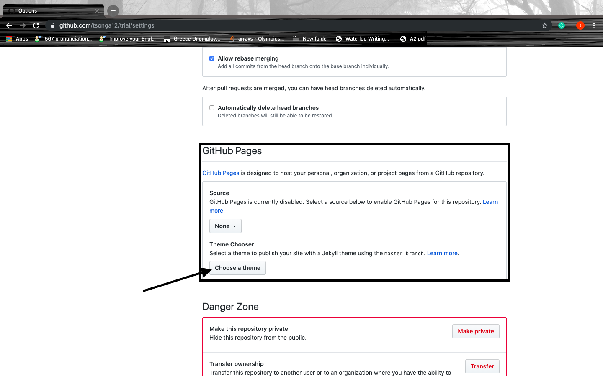

## How to Host Your Resume on GitHub Pages
 The purpose of creating this instruction file is to help people who have limited experiences in hosting their resume online using a buit-in GitHub's feature - GitHub Pages and formatting them using Jekyll theme chosen from GitHub Pages settings. In order to do it, a provided instruction set of the process of making it will be shown step by step in the next sections. Again, this instruction is only suitable for people who don't have much experience/technical background in hosting/formatting resumes online using GitHub Pages and Jekyll theme, for others who want to do advanced formatting using Jekyll-supported theme such as forking an existing theme or creating your own theme in Jekyll please have a look at others advanced tutorials online to serve the desired goals.

## Prerequisites
 There are two things needed to be done prior to host the resume online using GitHub Pages:
-  A current resume using MarkDown syntax in the local machine
-  A GitHub account, this can be done by simply signing up in this [Sign-up link](https://github.com/join).

## Hosting the resume on GitHub Pages
### Create a repository
  After creating an account, a repository is needed for storing the resume as well as the documentation (images, video, README.md file, etc. ) that come with it. It can be accomplished by doing the following steps:

1. Go to the main page -> click on the plus sign at the top right corner -> click on "New repository"

2. Next, write the repository name in form of "UserName.github.io" with UserName is your GitHub's username. Make sure username match with the username used for creating the account, otherwise, creating the repository cannot be done. After write down the name, click on "Create repository".

### Create a README file
  Creating the README file is important and it needs to be included right after you created the repository since
  the file acts as the front page of your repository (Everyone will look at your README file first before other things)
  . README file contains the information that allows the visitors to have an overview of your repository such as what the repository is about, how to get started, etc. You can create a readme file by doing following steps:

1. Go to the repository and click README

2. Save the file

### Upload resume to the repository that just created
  It's time to upload the resume to the repository with the name "index.md". The reason behind the name is when adding the Jekyll theme afterwards, the theme will be applied to the index.md file only. Follow the steps below to upload the resume to the repository.
1. Go to the repository then click "Create new file"

2. Name the file as index.md and paste your resume in the file.

3. Save the file.

### Format the resume using Jekyll theme chosen from GitHub Pages settings
  Now the resume it's up. It's time to format the resume using the Jekyll theme chosen from GitHub Pages settings. Here are the steps:

  1. Go to the repository then choose Settings.

 2. Scroll down until "GitHub Pages" section, then click "choose theme"
 

 3. Choose one and click "Select theme", now the index.md(Resume) has been applied the selected theme.

 4. The file "-config.yml" will appear in the repository. It's the file that needs to be modify in order to format the resume.
 For example, adding the "title: Resume of Tsonga12" will change the title of the resume to Resume of Tsonga12. All the syntax for modifying the
 file is contained in the Jekyll official site [YAML front matter parameters](https://jekyllrb.com/docs/front-matter/).

## Resources

## Authors and Acknowledgments

## FAQs
