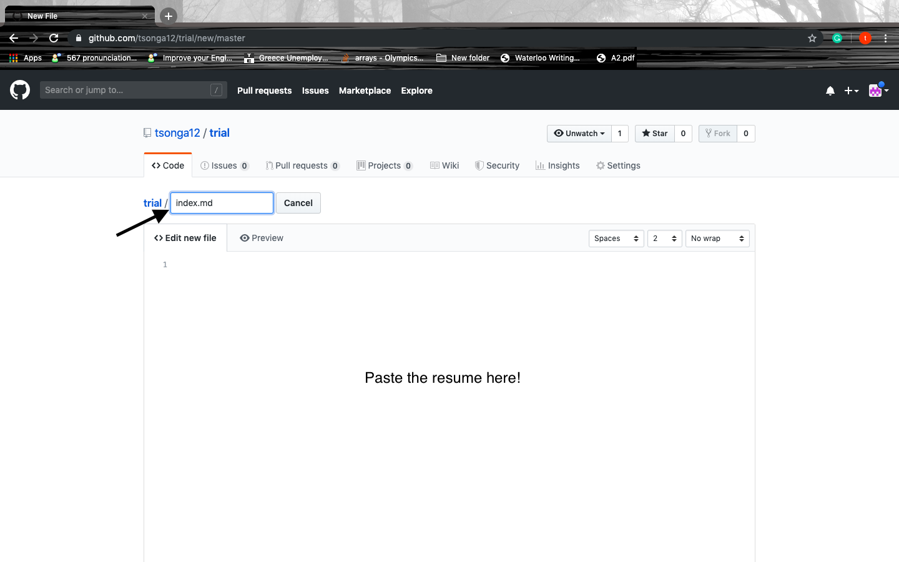
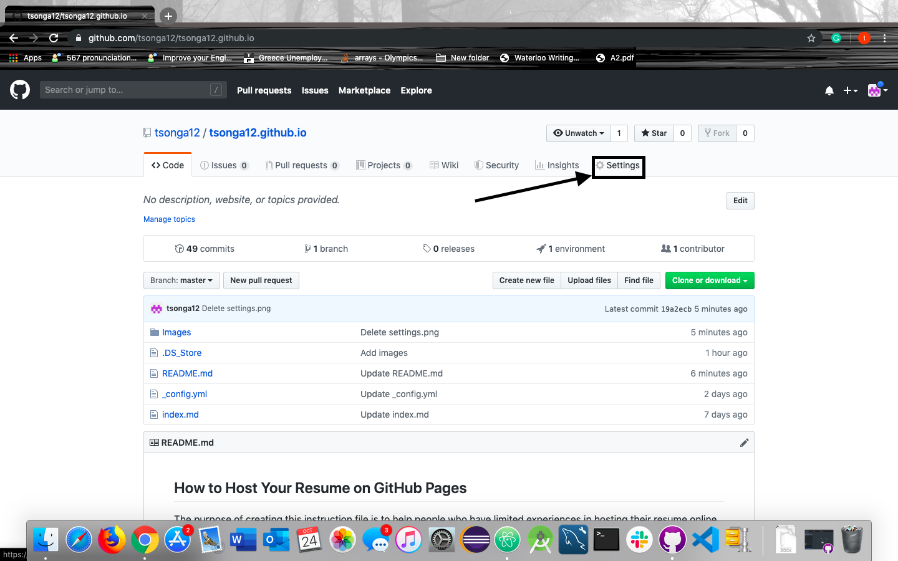

# How to Host Your Resume on GitHub Pages
## Intended Audience
 The purpose of creating this instruction file is to help people who have limited experience(very little or some experience) in hosting their resume (written in MarkDown) online using Atom, a built-in GitHub's feature - GitHub Pages and formatting them using Jekyll theme chosen from GitHub Pages settings. In order to do it, a provided instruction set of the process of making it will be shown step by step in the next sections. Again, this instruction is only suitable for people who don't have much experience/technical background in hosting/formatting resumes online using GitHub Pages and Jekyll theme, for others who want to do advanced formatting using Jekyll-supported theme such as forking an existing theme or creating your own theme in Jekyll please have a look at others advanced tutorials online to serve the desired goals.

## Prerequisites
 There are two things needed to be done prior to host the resume online using GitHub Pages:
-  A current resume in the local machine
-  A GitHub account, this can be done by simply signing up in this [Sign-up link](https://github.com/join).
-  Atom (IDE that used to write the resume in MarkDown), this can be done by simply download from this [Atom download link](https://atom.io/).
-  Finish [MarkDown Tutorial](https://www.markdowntutorial.co/) in order to be familiar with MarkDown syntax.

## Hosting the resume on GitHub Pages

### Transform the current resume into MarkDown version
  In order to work with MarkDown, a text editor/IDE  is needed. Since Atom works well with MarkDown and it integrates with GitHub, it is chosen to be the text editor for this tutorial. For the sake of simplicity, integrating with GitHub will not be covered. Here are the steps needed to accomplish the task.

1. Create a new file in Atom and name it as index.md.

2. Paste the current resume to the file and start formatting the resume using MarkDown syntax. If the resume is not formatted with MarkDown then the resume is posted in GitHub won't display as wanted since GitHub only understands the MarkDown syntax.

### Create a repository
  After having the resume in MarkDown, a repository is needed for storing the resume as well as the documentation (images, video, README.md file, etc.) that come with it. It can be accomplished by doing the following steps:

1. Go to the main page -> click on the plus sign at the top right corner -> click on "New repository".

2. Next, write the repository name in the form of "UserName.github.io" with UserName is your GitHub's username. Make sure username matches with the username used for creating the account, otherwise, creating the repository cannot be done. After writing down the name, click on "Create repository".

### Create a README file
  Creating the README file is important and it needs to be included right after you created the repository since
  the file acts as the front page of your repository (Everyone will look at your README file first before other things).
  README file contains the information that allows the visitors to have an overview of your repository such as what the repository is about, how to get started, etc. You can create a readme file by doing the following steps:

1. Go to the repository and click README.

2. Save the file.

### Upload resume to the repository that just created
  It's time to upload the resume to the repository with the name "index.md". The reason behind the name is when adding the Jekyll theme afterward, the theme will be applied to the index.md file only. Follow the steps below to upload the resume to the repository.
1. Go to the repository then click "Create new file".

2. Name the file as index.md and paste the resume in the file.

3. Save the file.

### Format the resume using Jekyll theme chosen from GitHub Pages settings
  Now the resume it's up. It's time to format the resume using the Jekyll theme chosen from GitHub Pages settings. Here are the steps:

  1. Go to the repository then choose Settings.

 2. Scroll down until "GitHub Pages" section, then click "choose a theme".

 3. Choose one and click "Select theme", now the index.md(Resume) has been applied to the selected theme.

 4. The file "-config.yml" will appear in the repository. It's the file that needs to be modified in order to format the resume.
 For example, adding the "title: Resume of Tsonga12" will change the title of the resume to "Resume of Tsonga12". All the syntax for modifying the
 file is contained in the Jekyll official site [YAML front matter parameters](https://jekyllrb.com/docs/front-matter/).

## Resources
- Here’s an intro to [GitHub Pages](https://help.github.com/en/categories/workingwith-github-pages).
- Here’s an intro to [GitHub Flavored Markdown](https://github.github.com/gfm/).
- Here's the [MarkDown Tutorial](https://www.markdowntutorial.co/).
- Here's the file contains all of [Images](https://github.com/tsonga12/tsonga12.github.io/tree/master/Images) used in this tutorial.
- Here's the full [Repository](https://github.com/tsonga12/tsonga12.github.io) that contains a sample resume written in Markdown as well as this README.md file.
- Jekyll official site [YAML front matter parameters](https://jekyllrb.com/docs/front-matter/) contains the syntax for modifying the YAML front matter.

## Authors and Acknowledgments
- Duc Anh Nguyen - Who wrote this README.md.
- My COMP3040's instructor Christina Penner who
  - Shared the MarkDown tutorial and resources stated above.
  - Provided a Resume Workshop.
  - Recommendation for the text editor.
- Andrew Etter who is the author of "Modern Technical Writing" book that helps understanding how to combine tools to produce well-written documents.

## FAQs
1. Can I use other text editors instead of Atom?
   - Yes! You can use any text editor as long as they support MarkDown, but I recommend using text editors that are lightweight and easy to use such as [Sublime Text](https://www.sublimetext.com/) or [Visual Code Studio](https://code.visualstudio.com/) if you don't want to use Atom.

2. Why should I create a resume using MarkDown and host it in GitHub Pages instead of a static website written in plain HTML and CSS?
   - In the industry, we usually apply for jobs online and MarkDown is one of the most efficient ways of doing so since the syntax of MarkDown is easy to learn (There's no need to have a technical background to do so) compared to HTML and CSS where you really need a bit "programming". Also, GitHub lets its users host one free static website so that users don't have to buy anything to host their website as usual.

3. Can I use other platforms that's similar to GitHub to host my resume?
   - Yes! My recommendation is GitLab which is quite similar to GitHub, here is the [GitLab's link](https://about.gitlab.com/blog/2016/04/07/gitlab-pages-setup/) of instruction for hosting the resume online using GitLab Pages

4. What are the pros and cons of MarkDown that I should consider before using it?

   |              Pros                  |               Cons                    |
   |------------------------------------|---------------------------------------|
   | Easy to read                       | No standard format                    |
   | Support formatting content quickly | Not a replacement for HTML            |
   | the syntax is clean, simple            | Lack of semantic meaning/extensibility|
   | Can run across platforms           | Too many flavors                      |
